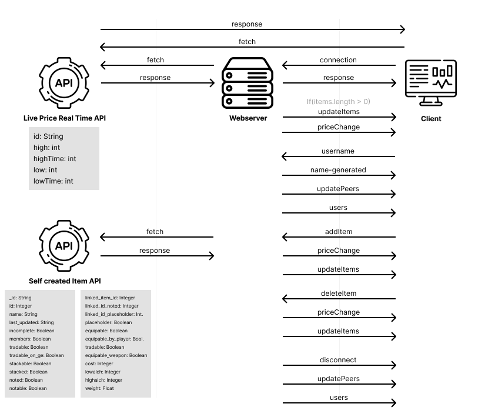

# ⚙ Old school Runescape Live loot splitter (OSRS-LLS)

<br>
[⚙ Link to live product](http://osrslls.herokuapp.com/)


## 📂 Assignment
The assignment is to build a real-time application, where an open connection between the client and the server is needed, and make it so that the client and server can communicate both ways in real time at the same time

## 🧾 Table of contents
-   [About the project](##About-the-project)
      * [Built with](###Built-with)
      * [Features](###Features)
      * [Micro libraries](###Micro-libraries)
-   [Activity Diagram](##Activity-Diagram)
-   [Getting started](##Getting-started)
      * [Installation](##Installation)
-   [Packages/dependecies](##Packages/dependecies)
      * [Packages/dependecies](###Dependecies/Packages)
-   [License](##License)
-   [Contributers and their role](##Contributers)

## 📖 About the project
My project is about a game I play, the game is called [Old school runescape](https://oldschool.runescape.com/) a MMORPG where you can play with friends and grind for better gameplay. In this game you can also fight bosses with friends, for that purpose I built a live loot splitter, where everyone can fill in the loot that they gathered so it can be evenly split between the teammates that were fighting with you.

### 🛠 Built with
The project is built with Socket.io, Javascript, Pug and SCSS

### 🌟 Features
- Filling in your username, the username is not connected to your account because such an API is non-existent.
- Search for an item that you have redeemed in the boss fight, with the data from my own API the: [OSRS-LLS-API](https://github.com/KoenHaagsma/OSRS-LLS-API).
- Filling in the items that you have redeemed in the boss fight.
- Removing an item if you fill in a wrong item.
- See live price data from the [OSRS real-time prices API](https://oldschool.runescape.wiki/w/RuneScape:Real-time_Prices).
- See the gold split that is based on the players connected and the items filled in.

### 🔁 API
In the application I used 2 API's, one I created myself and one that was already existing.

#### [OSRS LLS API](https://github.com/KoenHaagsma/OSRS-LLS-API)
This API is created by myself, I found a JSON that was pretty recently updated with all the items that are currently in the game. When trying to work with that JSON file I realised it was to slow to work with. I then came to the idea to upload all the data into MongoDB, I then built an API around that with Express.

I'm using this API to retrieve a single item when an user is searching for that item, it is also possible to pull a thousand items at the time but i'm not using that feature at the moment because i did not have a good purpose for it.

More detailed information is available at the [OSRS LLS API](https://github.com/KoenHaagsma/OSRS-LLS-API) github page.


#### [OSRS Real-time Prices](https://oldschool.runescape.wiki/w/RuneScape:Real-time_Prices)
I'm using the OSRS Real-time Prices for retrieving the current live price from in game. This data is real time so that makes for a up to date application.
The api retrieves a low and a high price for that moment, i'm using the average of that.

### ✔ Checklist
Checklist for showing what is done and what still can be done.<br>
- [x] Setting an username
- [x] Connecting to other users
- [x] Retrieving an item while searching for it
- [x] Retrieving live price data of an item while searching it
- [x] Viewing all items that are filled in currently by users
- [x] Seeing the live gold split that is based on users and item prices
- [ ] Connecting to private rooms
- [ ] Creating a private room for you and your friends
- [ ] Using it on mobile
- [x] Using it on desktop
- [x] Forgiving when searching for items
- [x] Removing items from the current list.
- [x] Feedback when something went wrong.
- [ ] Loading states

## 🎱 Data lifecycle
<br>

## 🚦 Real time events
Here a detailed description of the real time events that are being used on the site.

### Connection
The connection event is called when a new user connects to the server, every other event that is being used is nested in the connection event. When connecting the nickname is set from the page before, the user is connected after they've filled in the form in the page before, before that the user is not connected to the socket server.

### NameGenerated
When a user has just connected the NameGenerated event is emitted, I'm using this event to set the name filled in to the client, so i can use that for showing if the person itself is connected, the style is different for every user connected in the connected user list.

### UpdatePeers
The UpdatePeers event is also called when a user had just connected, UpdatePeers shows a list of every user connected on the client side, every time a user connects or disconnects the UpdatePeers event is called, so on 'connection' and on 'disconnect', this keeps a real time list of all connected users shown on the client.

### Users
The Users event is also called on connection this event emits the count of users connected, same as the UpdatePeers event this event is also called on the 'connection' and 'disconnect' event. On the client side is it used to simply show a real time counter of all the connected users.

### UpdateItems
The UpdateItems event is also called on connection but only when there have already been some items filled in, this to show just connecting users what items have already been added. This event is also called when the AddItem event calls, it is mainly used there because when a user fills in an item the item list needs to be send to the other clients to show the real time items that are added.

### PriceChange
PriceChange is also being called on connection, this because the price split is based on the number of users connected. The event is also called when adding an item to the live list and when a user disconnects.

### AddItem
AddItem is called when a user fills in an item on the client side, it get's emitted from the client to the server, the client fetches the item data and sends it to the server, the server then fetches the price data that is related to that item, the price data and a formatted Object with only necessary data is then send back to all other clients including the senders client where it get's added to the list

### Error
The error event is only emitting from the server, this is being used to send the client feedback that for example a fetch went wrong, this only get's send to the client that triend to fetch an item.

### Disconnect
The disconnect event is self explanatory this event get's called when a client disconnects from the server, this happens for example when a user closes their browser.

## 🔍 Getting started
*Before you can start you need to follow the installation*

## 🔨 Installation
1. Open the terminal, or use the terminal in your IDE

2. Clone the repository
```
git clone https://github.com/KoenHaagsma/Food-Finder-PWA.git
```
3. Go to the cloned repository
```
cd Food-Finder-PWA
```
4. Install all packages
```
npm install || npm i
```
5. Start the application for development
```
npm run dev
```
6. Open de server and go to the browser: [Localhost:4242](http://localhost:4242). If this doesn't work change your port to another portbottom: 'Go live'

## 🧰 Packages/dependecies

### 🧱 Dependecies/Packages
- [cors](https://www.npmjs.com/package/cors)
- [dotenv](https://www.npmjs.com/package/dotenv)
- [express](https://www.npmjs.com/package/express)
- [node-fetch](https://www.npmjs.com/package/node-fetch)
- [path](https://www.npmjs.com/package/path)
- [socket.io](https://www.npmjs.com/package/socket.io)
- [toastify-js](https://www.npmjs.com/package/toastify-js)
- [pug](https://www.npmjs.com/package/pug)
- [nodemon](https://www.npmjs.com/package/nodemon)

## 📑 Sources
- [toastify-js](https://apvarun.github.io/toastify-js/)
- [WDS socket io](https://www.youtube.com/watch?v=ZKEqqIO7n-k&t=1418s)


## 🔖 License
[]()
